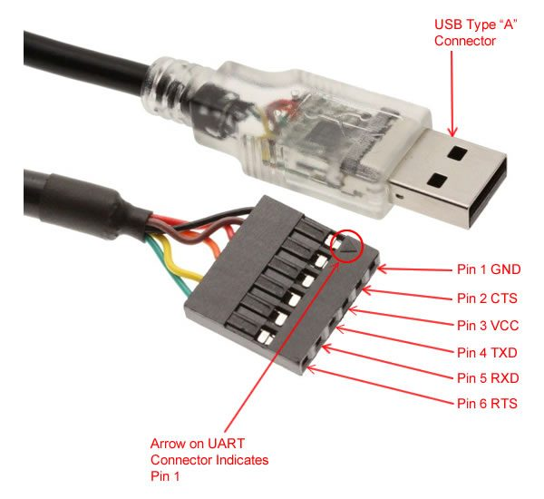

# How to Update AT firmware on ESP32

## Download binaries:
https://docs.espressif.com/projects/esp-at/en/latest/AT_Binary_Lists/ESP32_AT_binaries.html

## Install upload tool
pip3 install esptool

## Upload firmware
navigate into folder and run
 * macosx
    esptool.py --chip auto --port /dev/tty.usbserial-14430 --baud 115200 --before default_reset --after hard_reset write_flash -z download.config
    esptool.py --chip auto --port /dev/tty.usbserial-14430 --baud 115200 --before default_reset --after hard_reset write_flash -z --flash_mode dio --flash_freq 40m --flash_size 4MB 0x8000 partition_table/partition-table.bin 0x10000 ota_data_initial.bin 0xf000 phy_init_data.bin 0x1000 bootloader/bootloader.bin 0x100000 esp-at.bin 0x20000 at_customize.bin 0x24000 customized_partitions/server_cert.bin 0x39000 customized_partitions/mqtt_key.bin 0x26000 customized_partitions/server_key.bin 0x28000 customized_partitions/server_ca.bin 0x2e000 customized_partitions/client_ca.bin 0x30000 customized_partitions/factory_param.bin 0x21000 customized_partitions/ble_data.bin 0x3B000 customized_partitions/mqtt_ca.bin 0x37000 customized_partitions/mqtt_cert.bin 0x2a000 customized_partitions/client_cert.bin 0x2c000 customized_partitions/client_key.bin

* References
https://docs.espressif.com/projects/esp-at/en/latest/Get_Started/Downloading_guide.html

## USB to UART
You need to connect an external USB to UART converter, because the UART0 which is connected to the internal USB of esp32 Wroom it is used by the firmware as a debugger. It is possibile to modify the firmware to map all the AT communication to the UART0 and avoid the debugging. However here we won't show it how.

### ESP32 UART1 Pin out

- **UART1**
AT command/response 
    ESP32	       USB to Serial Converter
    GPIO16 (RX)        TX    Orange
    GPIO17 (TX)        RX    Yellow
    GPIO15 (CTS)       RTS
    GPIO14 (RTS)       CTS
    USB to serial converter
    TX
    RX
    RTS
    CTS

- **UART0** 
(for reference)
UART0       PC
GPIO3 (RX)  TX
GPIO1 (TX)  RX

